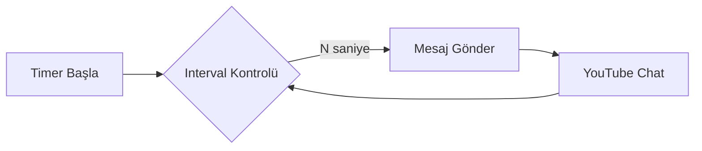
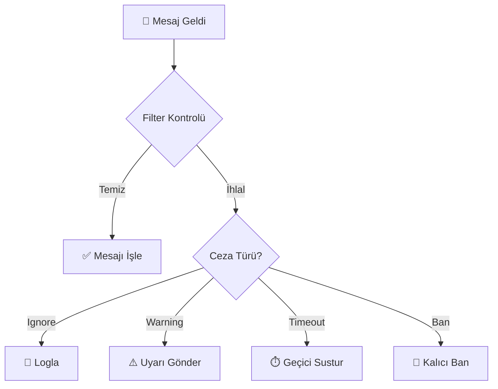
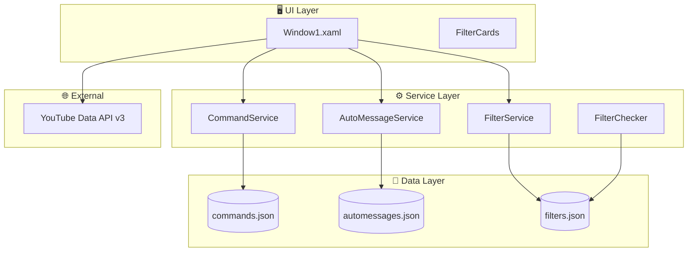

<div align="center">

# 🤖 YouTube Chat Bot V2

### Modern • Güçlü • Profesyonel

**Nightbot/StreamElements seviyesinde YouTube canlı yayın sohbet moderasyon botu**


[Özellikler](#-özellikler) •
[Mimari](#-mimari) •
[Kurulum](#-kurulum) •
[Ekran Görüntüleri](#-ekran-görüntüleri)

---

**⚠️ Bu repository showcase amaçlıdır. Kaynak kod özeldir.**

</div>

---

## 🎯 Proje Hakkında

YouTube Chat Bot V2, canlı yayınlarınız için profesyonel düzeyde chat moderasyonu sunan bir masaüstü uygulamasıdır. WPF ve .NET 8.0 ile geliştirilmiş, modern karanlık tema arayüzüne sahiptir.

### Neden Bu Bot?

| Özellik | YouTube Chat Bot V2 | Diğer Botlar |
|---------|:-------------------:|:------------:|
| Masaüstü Uygulaması | ✅ | ❌ Web tabanlı |
| Tamamen Ücretsiz | ✅ | 💰 Premium |
| Açık Kaynak Mimari | ✅ | ❌ Kapalı |
| Özelleştirilebilir | ✅ | ⚠️ Sınırlı |
| Türkçe Arayüz | ✅ | ❌ İngilizce |

---

## ✨ Özellikler

### 🧩 Akıllı Komut Sistemi

```
Kullanıcı: !discord
Bot:      Discord sunucumuza katıl: discord.gg/xxxxx
```

- ✅ Özel prefix desteği (`!`, `?`, `/` vb.)
- ✅ Sınırsız komut tanımlama
- ✅ Anlık ekleme/düzenleme/silme
- ✅ JSON tabanlı kalıcı depolama

---

### ⏱️ Otomatik Mesaj Sistemi



- ✅ Saniye bazlı zamanlama
- ✅ Çoklu otomatik mesaj
- ✅ Bot başladığında otomatik aktif

---

### 🛡️ Profesyonel Moderasyon Sistemi

**Nightbot tarzı kart tabanlı filter yönetimi**

```
┌─────────────────┐  ┌─────────────────┐  ┌─────────────────┐
│ 🚫 Yasaklı      │  │ 🔠 Aşırı Büyük  │  │ 😀 Aşırı Emoji  │
│    Kelimeler    │  │    Harf         │  │                 │
│ [🟢 Açık]       │  │ [⚫ Kapalı]     │  │ [🟢 Açık]       │
│ ⚙️ Ayarlar      │  │ ⚙️ Ayarlar      │  │ ⚙️ Ayarlar      │
└─────────────────┘  └─────────────────┘  └─────────────────┘

┌─────────────────┐  ┌─────────────────┐  ┌─────────────────┐
│ 🔗 Linkler      │  │ #️⃣ Aşırı Sembol │  │ 🔁 Tekrar Eden  │
│                 │  │                 │  │    Mesajlar     │
│ [🟢 Açık]       │  │ [⚫ Kapalı]     │  │ [⚫ Kapalı]     │
│ ⚙️ Ayarlar      │  │ ⚙️ Ayarlar      │  │ ⚙️ Ayarlar      │
└─────────────────┘  └─────────────────┘  └─────────────────┘
```

#### Filter Detayları

| Filter | Kontrol | Varsayılan Eşik |
|--------|---------|-----------------|
| 🚫 **Blacklist** | Kelime listesi + kısmi eşleşme | Liste bazlı |
| 🔠 **Caps** | % büyük harf oranı | %70+ |
| 😀 **Emoji** | Emoji sayısı | 5+ emoji |
| 🔗 **Links** | URL pattern + whitelist | YouTube izinli |
| #️⃣ **Symbols** | % sembol oranı | %50+ |
| 🔁 **Repeat** | Aynı mesaj tekrarı | 3+ tekrar/60sn |

#### Ceza Akışı



---

## 🏗️ Mimari

### Sistem Mimarisi



### Proje Yapısı

```
YoutubeChatBotV2/
├── 📁 Models/
│   ├── README.md
│   ├── CommandModel.example.cs
│   ├── FilterEnums.example.cs
│   └── FilterModel.example.cs
│
├── 📁 Services/
│   ├── README.md
│   ├── FilterService.example.cs
│   ├── FilterChecker.example.cs
│   └── AutoMessageRunner.example.cs
│
├── 📁 View/
│   ├── README.md
│   └── Window1.xaml
│
├── 📁 Assets/
│   └── screenshots/
│
├── .gitignore
└── README.md
```

---

## �️ Teknoloji Stack

<div align="center">

| Katman | Teknoloji |
|--------|-----------|
| **Framework** | .NET 8.0 |
| **UI** | WPF + XAML |
| **API** | YouTube Data API v3 |
| **Auth** | Google OAuth 2.0 |
| **Serialization** | System.Text.Json |
| **Pattern** | Service Layer |

</div>

---

## � Ekran Görüntüleri

> 📌 Ekran görüntüleri `Assets/screenshots/` klasöründe yer alacaktır.

### Ana Ekran
- Karanlık tema
- Tab tabanlı navigasyon
- Sistem logları + canlı chat

### Moderasyon
- 6 filter kartı
- Toggle açma/kapama
- Ayar dialog'ları

---

## 📄 Kaynak Kod

⚠️ **Kaynak kod özeldir.**

Bu repository:
- ✅ Mimari yapıyı gösterir
- ✅ UI tasarımını sergiler
- ✅ Özellikleri tanıtır
- ❌ Gerçek implementasyonu içermez

**Kaynak kod talep üzerine paylaşılabilir.**

📧 İletişim: [email@example.com]

---

## 📝 Lisans

Bu proje **MIT** lisansı altında lisanslanmıştır.

---

<div align="center">

### ⭐ Bu projeyi beğendiyseniz yıldız vermeyi unutmayın!

**Made with ❤️ using C# and WPF**

</div>
