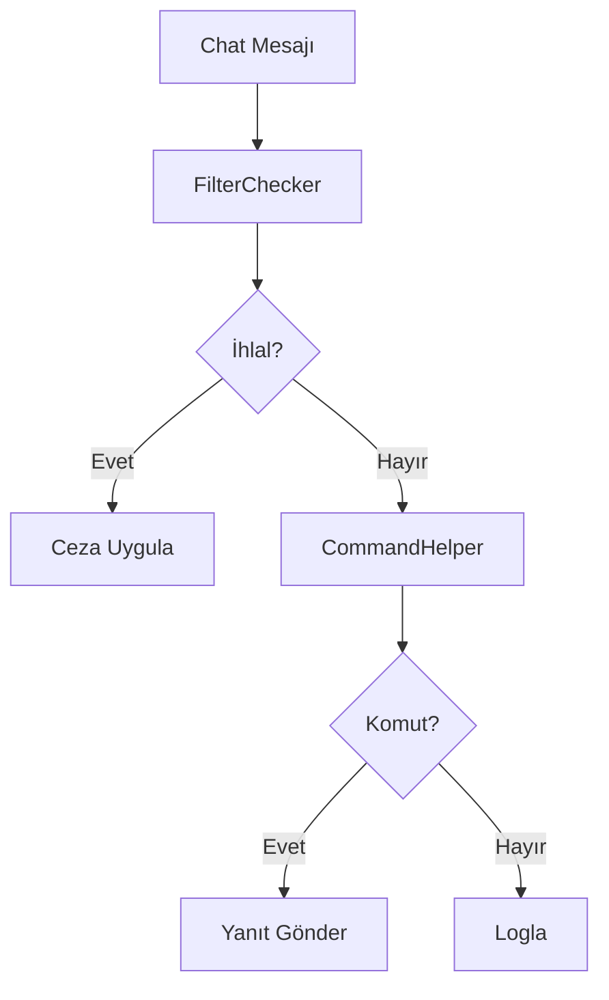

# ⚙️ Services

Bu klasör botun tüm iş mantığını içerir.

## Servisler

| Servis | Sorumluluk |
|--------|------------|
| `CommandService` | Komut CRUD işlemleri |
| `CommandHelper` | Mesaj-komut eşleştirme |
| `AutoMessageService` | Otomatik mesaj CRUD |
| `AutoMessageRunner` | Timer yönetimi |
| `FilterService` | Filter CRUD + JSON persist |
| `FilterChecker` | 6 filter algoritması |
| `FilterDefaults` | Varsayılan filter değerleri |
| `BotSettingsService` | Bot ayarları yönetimi |

## Mimari Akış

## Filter Algoritmaları

### Blacklist Words
- Kelime listesi kontrolü
- Case-insensitive veya sensitive
- Partial match veya exact match

### Excess Caps
- Mesajdaki büyük harf yüzdesi
- Minimum mesaj uzunluğu kontrolü
- Varsayılan eşik: %70

### Links
- URL pattern matching
- YouTube whitelist desteği
- Özel whitelist tanımlama

### Repetitions
- User bazlı mesaj geçmişi
- Time window içinde tekrar sayısı
- Varsayılan: 3 tekrar / 60 saniye

---

⚠️ **Kaynak kod özeldir.**
